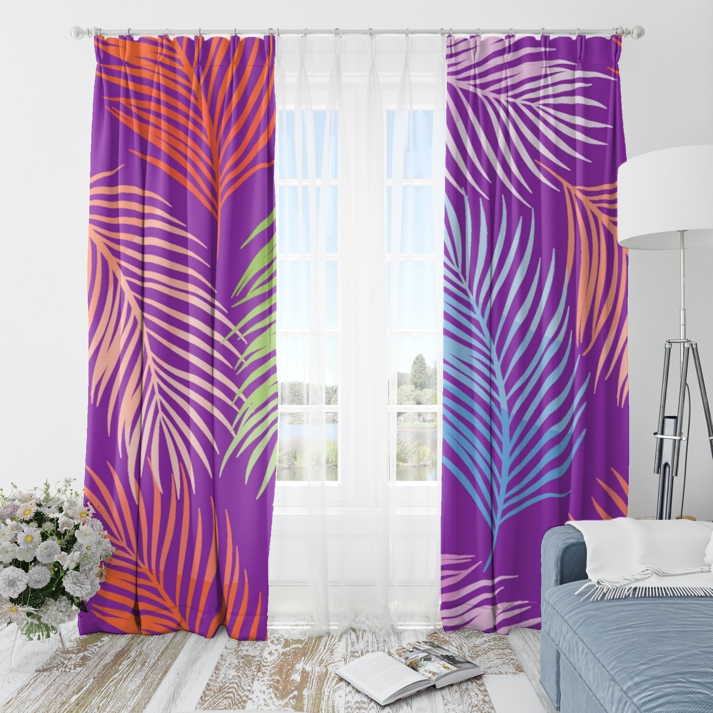
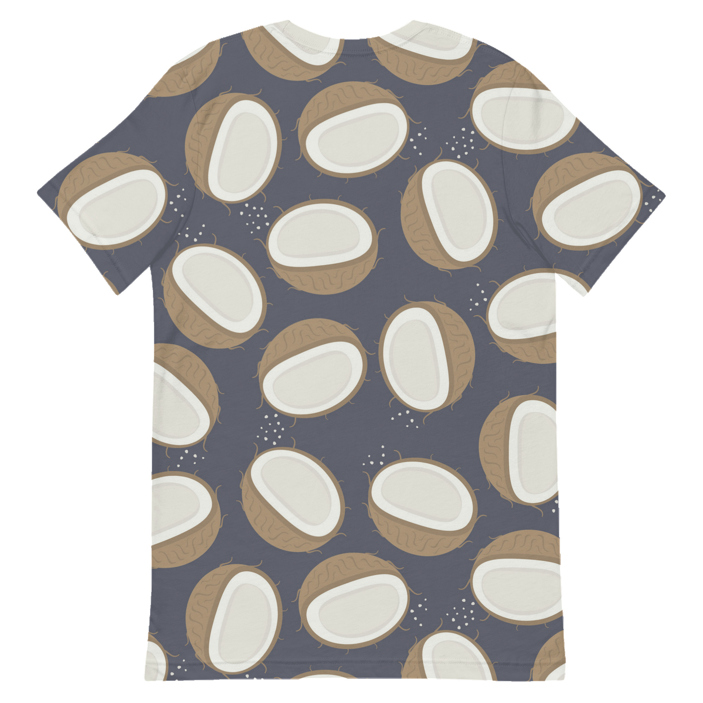

# **Product Mockup Generator API**

Hey there! 👋 This is your one-stop solution for creating stunning product mockups with automatic pattern tiling. Perfect for server-to-server communication, web applications, and automated mockup generation through a powerful REST API!

## **🚀 What You Get**

- **Multiple Products**: Curtains, mobile covers, curtains, mugs, and hoodies
- **Smart Tiling**: Automatic pattern tiling across entire surfaces
- **REST API**: Generate mockups via HTTP requests from any application
- **No File Storage**: Images returned directly in responses
- **API-Only Server**: Perfect for server-to-server communication
- **Cross-Platform**: Works on Windows (WSL2), Linux, and macOS

## **📦 Quick Setup**

### **Step 1: Install Dependencies**

Use NVM for managing Node.js versions (recommended), then install ImageMagick:

```bash
# Linux (Ubuntu/WSL2) — run these inside your Linux shell (e.g., Ubuntu on WSL2)

# 1) System update
sudo apt update && sudo apt upgrade -y

# 2) Install NVM (Node Version Manager)
curl -o- https://raw.githubusercontent.com/nvm-sh/nvm/v0.39.7/install.sh | bash

# 3) Load NVM into your current shell
#    Choose the line that matches your shell; you can add it to your shell RC file.
export NVM_DIR="$HOME/.nvm"
# bash
[ -s "$NVM_DIR/nvm.sh" ] && . "$NVM_DIR/nvm.sh"
[ -s "$NVM_DIR/bash_completion" ] && . "$NVM_DIR/bash_completion"
# zsh
# [ -s "$NVM_DIR/nvm.sh" ] && . "$NVM_DIR/nvm.sh"
# [ -s "$NVM_DIR/bash_completion" ] && . "$NVM_DIR/bash_completion"

# 4) Install and use the latest LTS Node.js
nvm install --lts
nvm use --lts

# 5) Verify versions
node -v
npm -v

# 6) Install ImageMagick
sudo apt install -y imagemagick
```

WSL2 Notes:
- Open “Ubuntu” (or your chosen distro) and run all commands there, not in Windows PowerShell.
- Your project path under WSL usually looks like `/home/<user>/mockup-main` (avoid working inside `/mnt/c/...` for better performance).
- If you hit ImageMagick policy limits on very large images, consider reducing image sizes or adjusting `policy.xml` (advanced), or run with smaller `useTiling`/`useDynamic` settings.

### **Step 2: Setup Project**

**For Local Environment (WSL2):**
```bash
cd /home/anya/mockup-main
```

**For Online/Server Environment:**
```bash
cd mockup
```

```bash
npm install
```

### **Step 3: Generate Required Maps**

```bash
bash ./src/create_maps.sh
```

### **Step 4: Start the API Server**

**For Production:**
```bash
npm start
```

**For Development (with auto-restart):**
```bash
npm run dev
```

That's it! Your server is now running on `http://localhost:5002` 🎉

### **Development Mode Features:**
- **Auto-restart**: Server automatically restarts when you make changes
- **File watching**: Monitors all JavaScript files for changes
- **Hot reload**: No need to manually stop/start the server
- **Verbose logging**: Shows detailed restart information

## **🎯 Perfect for API Integration**

### **Server-to-Server Communication**

Perfect for web applications, mobile apps, automated systems, or any application that needs to generate mockups programmatically.

#### **Generate Single Product Mockup**

```bash
curl -X POST \
  -F "artwork=@swatches/art1.jpg" \
  http://localhost:5002/api/mockup/generate/tshirt \
  --output tshirt_mockup.jpg
```

#### **Generate All Products**

```bash
curl -X POST \
  -F "artwork=@swatches/art1.jpg" \
  http://localhost:5002/api/mockup/generate \
  -o all_mockups.json
```

#### **Using Postman**

1. **Method**: POST
2. **URL**: `http://localhost:5002/api/mockup/generate/tshirt`
3. **Body**: form-data
4. **Key**: `artwork` (File type)
5. **Value**: Select your image file

### **Command Line (For Testing)**

For quick testing or batch processing.

```bash
node create_mockup.js --product=tshirt --artwork=swatches/art1.jpg
node create_mockup.js --product=mobile_cover --artwork=swatches/art2.jpg
```

## **📱 Available Products**

| Product | Best For | Pattern Size | Tiling |
|---------|----------|--------------|--------|
| **Curtain** | Apparel designs | 300x300px | ✅ Recommended |
| **Mobile Cover** | Phone cases | 400x600px | ✅ Optional |
| **Curtain** | Home decor | Any size | ✅ Recommended |
| **Mug** | Drinkware | 300x300px | ✅ Recommended |
| **Hoodie** | Apparel designs | Any size | ✅ Recommended |

  
## **🖼️ Expected Output Previews**

Below are sample mockups included in the repo under `DISPLAYREADME/` for quick visual reference.

| Product | Preview |
|---------|--------|
| Curtain |  |
| Mobile Cover |  |
| Testing2 (Generated) |  |
| Testing2 (Source Artwork) |  |


## **🔧 API Endpoints**

### **Health & Status**
- `GET /health` - Server health check
- `GET /api/mockup/products` - List available products
- `GET /api/mockup/products/:product/status` - Check product status

### **Mockup Generation**
- `POST /api/mockup/generate/:product` - Generate single product mockup
- `POST /api/mockup/generate` - Generate all products
- `POST /api/mockup/generate-base64/:product` - Generate from base64 image
 - `POST /api/mockup/create-product-and-generate` - Upload template+mask once, auto-generate maps, then apply a pattern

#### New: Create Product + Generate (Single-shot)

Endpoint: `POST /api/mockup/create-product-and-generate`

- Purpose: Create or reuse a product under `base_images/<foldername>`, generate maps (if not already present), and immediately return a mockup using your uploaded pattern image.
- Body: multipart/form-data
  - `foldername` (Text): product key, e.g. `custom_cover` (allowed: a–z, 0–9, `_`, `-`)
  - `template` (File): template image → saved as `base_images/<foldername>/template.jpg`
  - `mask` (File): mask image → saved as `base_images/<foldername>/mask.png`
  - `pattern-image` (File): pattern/artwork used to render the mockup
  - Optional flags (Text):
    - `useTiling`: `true` | `false` (default: `true`)
    - `useDynamic`: `true` | `false` (default: `false`)

Behavior:
- If `base_images/<foldername>` exists AND `maps/<foldername>` has all required maps, the endpoint skips re-copying base images and skips re-generating maps.
- Always applies the provided `pattern-image` to produce and return the mockup.
- Cleans `uploads/` after each request (preserves `.gitkeep`).

Response:
- Content-Type: `image/jpeg`
- Headers:
  - `X-Product`: `<foldername>`
  - `X-Maps-Generated`: `true` if maps were created in this request, otherwise `false`
  - `X-Options`: `{"useDynamic":boolean,"useTiling":boolean}`

Postman (form-data):
1. Method: POST
2. URL: `http://localhost:5002/api/mockup/create-product-and-generate`
3. Body → form-data:
   - `foldername` → Text → `custom_cover`
   - `useTiling` → Text → `false` (optional)
   - `useDynamic` → Text → `true` (optional)
   - `template` → File → select `template.jpg`
   - `mask` → File → select `mask.png`
   - `pattern-image` → File → select `pattern.jpg`

curl:
```bash
curl -X POST http://localhost:5002/api/mockup/create-product-and-generate \
  -F foldername=custom_cover \
  -F useTiling=false \
  -F useDynamic=true \
  -F template=@/path/to/template.jpg \
  -F mask=@/path/to/mask.png \
  -F pattern-image=@/path/to/pattern.jpg \
  --output custom_cover_mockup.jpg
```

### **Response Types**

#### **Single Product Response**
- **Content-Type**: `image/jpeg`
- **Response**: Direct image binary data
- **Headers**: `X-Product`, `X-Size`, `X-Options`

#### **All Products Response**
```json
{
  "success": true,
  "results": {
    "tshirt": {"success": true, "size": 245760},
    "mobile_cover": {"success": true, "size": 189234}
  },
  "mockups": {
    "tshirt": {
      "data": "data:image/jpeg;base64,/9j/4AAQ...",
      "size": 245760
    }
  }
}
```

## **💻 API Integration Examples**

### **From Another Node.js Server**

```javascript
import fetch from 'node-fetch';
import FormData from 'form-data';

const formData = new FormData();
formData.append('artwork', fs.createReadStream('image.jpg'));

const response = await fetch('http://your-api-server:5002/api/mockup/generate/tshirt', {
  method: 'POST',
  body: formData
});

const imageBuffer = await response.buffer();
fs.writeFileSync('mockup.jpg', imageBuffer);
```

### **From Python Server**

```python
import requests

with open('image.jpg', 'rb') as f:
    files = {'artwork': f}
    response = requests.post('http://your-api-server:5002/api/mockup/generate/tshirt', files=files)
    
with open('mockup.jpg', 'wb') as f:
    f.write(response.content)
```

### **From PHP Server**

```php
$ch = curl_init();
curl_setopt($ch, CURLOPT_URL, 'http://your-api-server:5002/api/mockup/generate/tshirt');
curl_setopt($ch, CURLOPT_POST, true);
curl_setopt($ch, CURLOPT_POSTFIELDS, $formData);
$response = curl_exec($ch);
file_put_contents('mockup.jpg', $response);
```

### **From cURL/Command Line**

```bash
curl -X POST \
  -F "artwork=@image.jpg" \
  http://your-api-server:5002/api/mockup/generate/tshirt \
  --output mockup.jpg
```

## **⚙️ Configuration**

### **Environment Variables**
```bash
PORT=5002
NODE_ENV=development
```

### **CORS Origins (For Web Applications)**
The server accepts requests from:
- `http://localhost:3000`
- `http://localhost:3001`
- `http://localhost:5000`
- `http://localhost:5001`
- Add your production domains as needed

### **Deployment Options**
- **AWS EC2**: 12 months free tier
- **Google Cloud**: Always free tier available
- **DigitalOcean**: $5/month for reliable hosting
- **VPS**: Full control with any provider

## **🚨 Troubleshooting**

### **"Product not ready"**
```bash
./create_maps.sh tshirt
```

### **"ImageMagick not found"**
```bash
sudo apt install imagemagick
```

### **"CORS error"**
Add your domain to the CORS configuration in `server.js`

### **"File too large"**
Images should be under 50MB

## **💡 Pro Tips**

1. **Use high-quality images** - Better input = better output
2. **Clean masks work best** - Crisp white areas for pattern placement
3. **Try seamless patterns** - They tile beautifully
4. **Experiment with sizes** - Different products work better with different pattern sizes
5. **Use the API** - Perfect for automation and integration

## **📊 Performance**

- **File Size Limit**: 50MB per request
- **Rate Limit**: 100 requests per 15 minutes per IP
- **Processing Time**: 2-5 seconds per mockup
- **Memory Usage**: Images processed in memory only
- **No File Storage**: Clean server with no disk usage
- **API-Only**: No frontend overhead, pure API performance

## **🛠️ Development**

### **Adding New Products**
1. Add product folder to `base_images/`
2. Include `template.jpg` and `mask.png`
3. Run `./create_maps.sh <product_name>`
4. Restart server

### **Available Scripts**
```bash
npm start          # Start production server
npm run dev        # Start development server with auto-restart (nodemon)
npm test           # Run API tests
npm run build      # Build check (no build step required)
npm run lint       # Lint check (no linting configured)
```

### **Development Workflow**
1. **Start development server**: `npm run dev`
2. **Make changes** to any JavaScript file
3. **Server auto-restarts** when you save changes
4. **Test your changes** immediately without manual restart

## **🎉 That's It!**

You now have a powerful API-only mockup generation system that can:
- Generate mockups via REST API from any application
- Handle multiple product types automatically
- Return images directly (no file storage)
- Scale automatically with your needs
- Perfect for server-to-server communication

Start integrating mockup generation into your applications today! ✨

Need help? Check out the API documentation at `http://localhost:5002/api/mockup/docs` when the server is running.